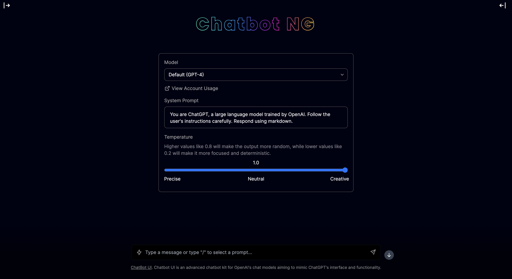

# Chatbot NG 🤖

Welcome to my Chatbot UI with Text-to-Speech (TTS) Capabilities! This is the home of an amazing chatbot UI that transforms GPT answers into audible speech. It's perfect for everyone, from beginners in the tech industry to seasoned developers.



## Features 🚀

1. **Convivial User Interface (UI)**: The chatbot UI was designed similarly to ChatGPT. It's easy-to-use, intuitive and highly responsive.
2. **Text-to-Speech Capabilities**: Incorporating cutting-edge TTS technology, the chatbot vocalizes the assistant's responses.
3. **Versatile Use Cases**: Whether you're building assistive technology or interactive tools, the chatbot fits right in!

## Getting Started 🎬

**1. Clone Repo**

```bash
cd chatbot-ng
git clone https://github.com/philt-one/chatbot-ng.git
```

**2. Provide OpenAI API Key**

Create a .env file in the root of the repo with your OpenAI API Key:

```bash
cp .env.example .env
```

> You can set `OPENAI_API_HOST` where access to the official OpenAI host is restricted or unavailable, allowing users to configure an alternative host for their specific needs.

> Additionally, if you have multiple OpenAI Organizations, you can set `OPENAI_ORGANIZATION` to specify one.

**3. Run App**

```bash
docker compose up -d
```

**4. Use It**

You should be able to start chatting! The UI should be accessible on http://localhost:3000/

## Configuration 🔧

When deploying the application, the following environment variables can be set:

| Environment Variable              | Default value                  | Description                                                                                                                               |
| --------------------------------- | ------------------------------ | ----------------------------------------------------------------------------------------------------------------------------------------- |
| OPENAI_API_KEY                    |                                | The default API key used for authentication with OpenAI                                                                                   |
| OPENAI_API_HOST                   | `https://api.openai.com`       | The base url, for Azure use `https://<endpoint>.openai.azure.com`                                                                         |
| OPENAI_API_TYPE                   | `openai`                       | The API type, options are `openai` or `azure`                                                                                             |
| OPENAI_API_VERSION                | `2023-03-15-preview`           | Only applicable for Azure OpenAI                                                                                                          |
| AZURE_DEPLOYMENT_ID               |                                | Needed when Azure OpenAI, Ref [Azure OpenAI API](https://learn.microsoft.com/zh-cn/azure/cognitive-services/openai/reference#completions) |
| OPENAI_ORGANIZATION               |                                | Your OpenAI organization ID                                                                                                               |
| DEFAULT_MODEL                     | `gpt-3.5-turbo`                | The default model to use on new conversations, for Azure use `gpt-35-turbo`                                                               |
| NEXT_PUBLIC_DEFAULT_SYSTEM_PROMPT | [see here](utils/app/const.ts) | The default system prompt to use on new conversations                                                                                     |
| NEXT_PUBLIC_DEFAULT_TEMPERATURE   | 1                              | The default temperature to use on new conversations                                                                                       |
| GOOGLE_API_KEY                    |                                | See [Custom Search JSON API documentation][GCSE]                                                                                          |
| GOOGLE_CSE_ID                     |                                | See [Custom Search JSON API documentation][GCSE]                                                                                          |

If you do not provide an OpenAI API key with `OPENAI_API_KEY`, users will have to provide their own key.

If you don't have an OpenAI API key, you can get one [here](https://platform.openai.com/account/api-keys).
